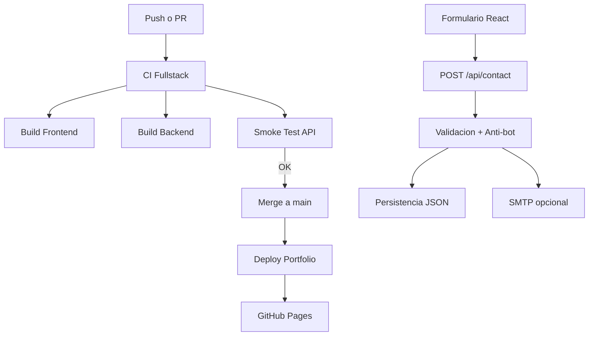

# Senior Portfolio · Pablo Andrés Suárez

```text
██████╗  █████╗ ███╗   ██╗    ██████╗ ███████╗██╗   ██╗
██╔══██╗██╔══██╗████╗  ██║    ██╔══██╗██╔════╝██║   ██║
██████╔╝███████║██╔██╗ ██║    ██║  ██║█████╗  ██║   ██║
██╔═══╝ ██╔══██║██║╚██╗██║    ██║  ██║██╔══╝  ╚██╗ ██╔╝
██║     ██║  ██║██║ ╚████║    ██████╔╝███████╗ ╚████╔╝
╚═╝     ╚═╝  ╚═╝╚═╝  ╚═══╝    ╚═════╝ ╚══════╝  ╚═══╝
```

[](https://github.com/palosuarez/portafolio/actions/workflows/deploy.yml)
[](https://github.com/palosuarez/portafolio/actions/workflows/ci-fullstack.yml)


[**→ Ver en producción**](https://palosuarez.github.io/portafolio/)

---

## Overview

Portafolio de desarrollo construido desde cero — sin templates, sin librerías de UI, sin componentes genéricos. Cada decisión de diseño y cada línea de código escrita a propósito.

Stack editorial oscuro con tipografía serif inesperada, efectos de reveal por CSS puro y arquitectura de componentes pensada para escalar.

---

## Stack

| Capa        | Tecnología                                                              |
| ----------- | ----------------------------------------------------------------------- |
| UI          | React 18 + TypeScript strict                                            |
| Build       | Vite 5 · ES2020 target                                                  |
| Estilos     | CSS Modules + Custom Properties — sin Tailwind, sin styled-components   |
| Animaciones | CSS keyframes + clip-path — sin GSAP, sin Framer Motion en efectos core |
| Fuentes     | DM Serif Display · DM Sans · JetBrains Mono (Google Fonts)              |
| Deploy      | GitHub Actions → GitHub Pages                                           |
| CI          | Workflow propio · build en ~22s                                         |

---

## Arquitectura

```text
src/
├── components/
│   ├── effects/
│   │   └── TextReveal          # Reveal letra por letra · clip-path + blur + glitch
│   ├── layout/
│   │   ├── Nav                 # Fixed · blur backdrop · scroll-aware
│   │   └── CIStrip             # Barra de estado · dot pulsando · badges mono
│   └── sections/
│       └── Hero                # 2 columnas · stats · layer stack · CTAs
├── data/
│   └── index.ts                # Proyectos · badges · experiencia — fuente única de verdad
├── styles/
│   └── tokens.css              # Sistema de diseño: colores · tipografía · espaciado
└── types/
    └── index.ts                # Project · Badge · Experience
```

**Principios aplicados:**

- Data separada de presentación — `data/index.ts` es la única fuente de verdad
- Un componente, un archivo CSS — sin estilos en línea
- Tokens CSS globales — cambiar `--accent` actualiza todo el sitio
- TypeScript strict — sin `any`, sin `as unknown`

---

## Sistema de diseño

```css
/* Paleta */
--bg-0: #090909; /* fondo base — casi negro, no puro */
--accent: #6c63ff; /* púrpura eléctrico */
--accent-verde: #00e5a0; /* terminal · CI · estado */

/* Tipografía */
--font-serif: 'DM Serif Display', serif; /* hero · títulos */
--font-body: 'DM Sans', sans-serif; /* body · párrafos */
--font-mono: 'JetBrains Mono', monospace; /* labels · código · nav */
```

**Decisión de diseño:** serif en hero vs. mono en UI crea contraste editorial — el elemento diferenciador visual más fuerte del sitio.

---

## Efecto TextReveal

El componente central del sitio. Implementado en CSS puro sin dependencias externas.

```text
Cada letra → span individual
Animación → clip-path: inset(0 100% 0 0) → inset(0 0% 0 0)
Timing   → 65ms de delay escalonado entre letras
Extras   → filter: blur() durante movimiento
           skewX(8deg) en frame -10% (glitch de 1 frame)
           saber-pulse: glow tipo sable de luz en "pan_dev"
```

---

## CI/CD

```yaml
# Push a main → build → deploy automático
on:
  push:
    branches: [main]

# Build: ~22s · Deploy total: ~42s
```

Pipeline: `checkout` → `node 20` → `npm install` → `npm run build` → `gh-pages deploy`

El sitio se actualiza solo. Cero intervención manual post-push.

Flujos en GitHub Actions:

- `Deploy Portfolio` → despliegue a GitHub Pages
- `CI Fullstack` → validación frontend + backend + smoke test de API

Orden recomendado:

1. CI Fullstack en PR/push
2. Deploy en `main` si el build de frontend está correcto

### Flujo visual



---

## Correr localmente

```bash
git clone https://github.com/palosuarez/portafolio.git
cd portafolio
npm install
cp .env.example .env
npm run dev
# → http://localhost:5173
```

**Requisitos:** Node.js 20+ · npm 9+

### Backend local (MVP contacto)

```bash
# instalar backend
npm --prefix backend install
cp backend/.env.example backend/.env

# levantar API local
npm run dev:api
# → http://127.0.0.1:8787
```

Endpoints:

- `GET /health`
- `POST /api/contact`

Persistencia local:

- `backend/data/messages.json`

Copia por correo (opcional):

- Configura `MAIL_ENABLED=true` en `backend/.env`
- Define `SMTP_*`, `MAIL_FROM` y `MAIL_TO` (actualmente destino sugerido: `palosuarez@gmail.com`)

---

## Roadmap

- [x] Sistema de tokens CSS
- [x] Componente TextReveal
- [x] Nav + CIStrip
- [x] Hero section
- [x] Deploy automático
- [ ] Sección Proyectos
- [ ] Sección Experiencia + Timeline
- [ ] Sección Stack
- [ ] Footer
- [ ] Modo reducción de movimiento (`prefers-reduced-motion`)
- [ ] SEO · Open Graph · meta tags

---

## Autor

**Pablo Andrés Suárez** · [pan_dev](https://palosuarez.github.io/portafolio/)

Full Stack Developer · Bogotá ·

[](https://github.com/palosuarez)
[](https://credly.com/users/pablo-andres-suarez-sandoval)

---

Construido sin templates · Diseñado con intención · Deployado con CI/CD.
